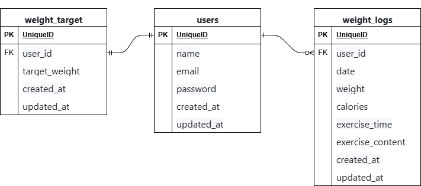

# PiGLy

体重管理アプリケーション

## 作成した目的

日々の体重・摂取カロリー・運動記録を管理し、目標体重達成をサポートするためのアプリケーションです。

## アプリケーションURL

- 開発環境：<http://localhost>
- 会員登録：<http://localhost/register>
- ログイン：<http://localhost/login>

## 機能一覧

- 会員登録
- ログイン / ログアウト
- 体重ログ一覧表示（ページネーション対応）
- 体重ログ新規登録
- 体重ログ詳細表示・編集・削除
- 目標体重設定・更新
- 日付検索

## 使用技術（実行環境）

- PHP 8.1
- Laravel 8.75
- MySQL 8.0.26
- nginx 1.21.1
- Docker / Docker Compose

## テーブル設計

### users テーブル

| カラム名   | 型           | PRIMARY KEY | UNIQUE | NOT NULL | FOREIGN KEY |
| ---------- | ------------ | ----------- | ------ | -------- | ----------- |
| id         | BIGINT       | ○           |        | ○        |             |
| name       | VARCHAR(255) |             |        | ○        |             |
| email      | VARCHAR(255) |             | ○      | ○        |             |
| password   | VARCHAR(255) |             |        | ○        |             |
| created_at | TIMESTAMP    |             |        |          |             |
| updated_at | TIMESTAMP    |             |        |          |             |

### weight_target テーブル

| カラム名      | 型           | PRIMARY KEY | UNIQUE | NOT NULL | FOREIGN KEY |
| ------------- | ------------ | ----------- | ------ | -------- | ----------- |
| id            | BIGINT       | ○           |        | ○        |             |
| user_id       | BIGINT       |             |        | ○        | users(id)   |
| target_weight | DECIMAL(4,1) |             |        | ○        |             |
| created_at    | TIMESTAMP    |             |        |          |             |
| updated_at    | TIMESTAMP    |             |        |          |             |

### weight_logs テーブル

| カラム名         | 型           | PRIMARY KEY | UNIQUE | NOT NULL | FOREIGN KEY |
| ---------------- | ------------ | ----------- | ------ | -------- | ----------- |
| id               | BIGINT       | ○           |        | ○        |             |
| user_id          | BIGINT       |             |        | ○        | users(id)   |
| date             | DATE         |             |        | ○        |             |
| weight           | DECIMAL(4,1) |             |        | ○        |             |
| calories         | INTEGER      |             |        |          |             |
| exercise_time    | TIME         |             |        |          |             |
| exercise_content | TEXT         |             |        |          |             |
| created_at       | TIMESTAMP    |             |        |          |             |
| updated_at       | TIMESTAMP    |             |        |          |             |

## ER図



## 環境構築

### Dockerビルド

1. リポジトリをクローン
```bash
git clone git@github.com:syosinsyananasi/pigly.git
cd pigly
```

2. Dockerコンテナを起動
```bash
docker-compose up -d --build
```

### Laravel環境構築

1. PHPコンテナに入る
```bash
docker-compose exec php bash
```

2. パッケージをインストール
```bash
composer install
```

3. 環境ファイルを作成
```bash
cp .env.example .env
```

4. `.env`ファイルの環境変数を変更
```
DB_CONNECTION=mysql
DB_HOST=mysql
DB_PORT=3306
DB_DATABASE=laravel_db
DB_USERNAME=laravel_user
DB_PASSWORD=laravel_pass
```

5. アプリケーションキーを生成
```bash
php artisan key:generate
```

6. マイグレーションを実行
```bash
php artisan migrate
```

7. シーディングを実行
```bash
php artisan db:seed
```

## ダミーデータ

シーディング実行後、以下のデータが作成されます：

| テーブル      | 件数 | 内容                           |
| ------------- | ---- | ------------------------------ |
| users         | 1件  | テストユーザー                 |
| weight_target | 1件  | テストユーザーの目標体重       |
| weight_logs   | 35件 | テストユーザーの体重記録       |

### テストアカウント

- メールアドレス：test@example.com
- パスワード：password
